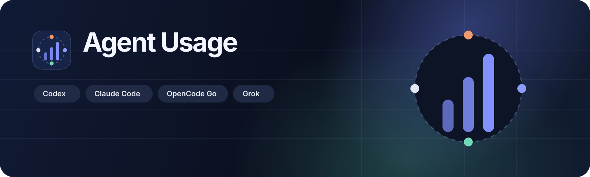

# Agent Usage

[English](README.md) · [简体中文](README.zh-CN.md)

[](https://github.com/Blackman99/agent-usage-all-in-one/actions/workflows/ci.yml)
[](https://www.npmjs.com/package/agent-usage-all-in-one)
[](LICENSE)

Agent Usage is a macOS-first, fully local usage center for Codex, Claude Code,
OpenCode Go, and Grok. One command opens a dashboard for native quota windows,
reset times, tokens, model rankings, equivalent API cost, history, and diagnostics.
It offers advice but never switches agents automatically.

## Dashboard

The dashboard has two primary tabs:

- **Agent usage** preserves each provider's native five-hour, weekly, monthly,
  All models, and Fable-only quota labels and reset times.
- **Tokens & model costs** supports 24-hour, 7-day, and 30-day ranges. It shows
  token categories, provider totals, daily trends, model rankings, and the public
  API retail equivalent of eligible token usage.

Actual charges, provider-reported estimates, fixed subscription fees, and API
retail equivalents are separate evidence. The API retail equivalent is not a bill
and is never presented as subscription spend. Unknown models or prices remain
unclassified or unpriced instead of being guessed or displayed as zero.

Grok Build/SuperGrok and xAI API are independent billing domains. Their quotas,
tokens, and costs are never added together.

## Fast, progressive startup

The loopback web service starts before connector discovery or data processing.
Cached results are available immediately while discovery, provider usage, model
pricing, and retention run as independent background modules. Each dashboard tab
shows only its own update indicator and completed sections remain usable.

Transcript scans use a persistent, path-redacted file index. Historical retail
pricing is recalculated only when the pricing catalog version changes. SQLite
time/provider/model indexes and retention compaction run in a worker after
provider collection, while price backfill processes bounded pages. Settings
includes an explicitly confirmed
**Hard rebuild all data** action for troubleshooting. It ignores these caches, can
use substantial resources, and may take a long time without blocking the web UI.

## Development

```bash
pnpm install
pnpm dev
```

This starts the source daemon, authenticated Vite proxy, hot reload, and dashboard.
Development state is isolated in the ignored `.agent-usage-dev/` directory. Use
`AGENT_USAGE_DEMO=1 pnpm dev` for demo data or `pnpm dev -- --no-open` to keep the
browser closed.

## Install and run

Agent Usage requires macOS and Node.js 24 or newer.

```bash
npm install --global agent-usage-all-in-one
agent-usage
```

To build and install a package from source:

```bash
pnpm install
pnpm build
archive=$(pnpm pack)
npm install --global "./$archive"
agent-usage
```

The daemon binds only to `127.0.0.1`. Application data is stored under
`~/Library/Application Support/Agent Usage` by default.

Common commands:

```bash
agent-usage status --window 7d
agent-usage doctor
agent-usage export --format json --window 30d
agent-usage export --format csv --window 7d
agent-usage retention --json
agent-usage retention --compact
agent-usage monitoring --json
agent-usage start-at-login enable
agent-usage clear --yes
```

## Provider coverage

| Provider / billing domain | Native quota                                                            | Token history                                       | Cost evidence                                                                          |
| ------------------------- | ----------------------------------------------------------------------- | --------------------------------------------------- | -------------------------------------------------------------------------------------- |
| Codex                     | Official account buckets when available                                 | Local rollouts with account-day reconciliation      | API retail equivalent                                                                  |
| Claude Code               | Experimental official-client usage, including All models and Fable only | Local session transcripts; optional OTLP supplement | Client estimate and API retail equivalent                                              |
| OpenCode Go               | Official account-wide five-hour, weekly, and monthly windows            | Official CLI/session export                         | Provider-reported or explicitly estimated values                                       |
| Grok Build / SuperGrok    | Experimental shared subscription allowance                              | Local `updates.jsonl`; optional OTLP supplement     | Client estimate and API retail equivalent, including recognized Grok 4.6 Build aliases |
| Grok · xAI API            | No subscription quota                                                   | Official Management API aggregation                 | Actual USD amounts, balance, limit, and invoice when available                         |

Every value retains its authority and observation time. Account-wide and this-Mac
evidence remain visibly distinct.

## Credentials and privacy

Official-client credentials stay in their owning clients and are neither copied
nor displayed. The optional xAI Management key is the only product-owned secret;
it is stored in macOS Keychain. The dashboard uses a one-time launch token,
HttpOnly session cookie, and same-origin mutation protection.

All usage data remains local. JSON and CSV exports omit account identifiers,
session IDs, cookies, OAuth tokens, and secret values by default. Raw observations
are retained for 90 days, then transactionally compacted into UTC daily aggregates.
Clearing local usage never deletes credentials owned by Codex, Claude Code,
OpenCode, or Grok.

## Verification

```bash
pnpm format:check
pnpm lint
pnpm check
pnpm test
pnpm build
pnpm test:package
pnpm test:e2e
```

See the [official pricing evidence](docs/research/official-pricing-sources-2026-08-28.md),
[connector receipts](docs/release/connector-receipts-2026-08-28.md), and
[open-source notices](docs/open-source.md).

## License and community

MIT — see [LICENSE](LICENSE). Also see [CONTRIBUTING.md](CONTRIBUTING.md),
[SECURITY.md](SECURITY.md), [CODE_OF_CONDUCT.md](CODE_OF_CONDUCT.md),
[THIRD_PARTY_LICENSES.md](THIRD_PARTY_LICENSES.md), and
[THIRD_PARTY_NOTICES.md](THIRD_PARTY_NOTICES.md).
