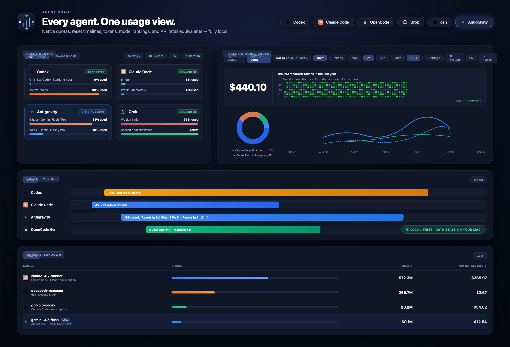

# Agent Usage

[English](README.md) · [简体中文](README.zh-CN.md)

[](https://github.com/Blackman99/agent-usage-all-in-one/actions/workflows/ci.yml)
[](https://www.npmjs.com/package/agent-usage-all-in-one)
[](LICENSE)

Agent Usage 是一个 macOS 优先、完全在本地运行的用量中心。一次启动即可统一查看
Codex、Claude Code、OpenCode 与 Grok 的原生额度窗口、刷新时间、Token、模型排行、
API 对等费用、历史与诊断。它只提供建议，不会自动切换 Agent。

## 核心页面

页面只有两个主要标签页：

- **Agent 用量**：保留各平台原生的 5 小时、周、月、All models 和 Fable only 等额度标签与刷新时间。
- **Token 与模型费用**：支持 24 小时、7 天和 30 天范围。顶部优先展示汇总信息，随后用图表展示 Provider 占比和可交互的每日趋势，再以占比条呈现模型排行及符合条件的 Token 按公开 API 价格计算出的对等费用。

在设置中填写各订阅的价格后，同一标签页会多出**订阅性价比**视图：把订阅价按所选时间窗摊销，
与该订阅产出的 Token 的 API 对等价做对比，在图谱上以保本线定位每个订阅，并给出价值倍数、
你实际付出的每百万 Token 单价与市场单价。再填上续费日，还会按每个订阅**自己的计费周期**单独衡量：
显示本周期已经走了多少天、已回本多少，以及按当前进度能否回本，这样处在第一周的订阅不会和处在第四周的订阅被放在一起比。
订阅价只是本机声明，不会变成费用记录，也不会进入任何费用合计。

实际账单、平台报告估算、固定订阅费和 API 对等零售价是四类互不混合的证据。
API 对等零售价不是账单，也不会被描述成订阅支出。模型或价格未知时保持未分类或未定价，
不会猜测，更不会显示成 0。

Grok Build/SuperGrok 与 xAI API 是两个独立计费域，其额度、Token 和费用永远不会相加。

## 快速渐进式启动

本地 Web 服务会先启动，再在后台运行连接发现、平台用量、模型定价和保留整理四个独立模块。
已有缓存会立即展示；每个标签页只在自己的数据区域显示更新状态，已经完成的内容始终可用。

本地会话记录扫描使用跨进程持久化且不保存原始个人路径的文件索引。历史费用只在价格目录版本变化时
重新计算，并按有限批次处理；时间、平台、模型和计费域索引及保留期整理会在平台采集完成后交给后台
工作线程执行。设置里提供需要明确确认的
**硬重算全部数据**：它会忽略缓存、消耗较多资源，并且可能等待很久，但不会阻塞页面。

## 开发调试

```bash
pnpm install
pnpm dev
```

该命令会启动源码守护进程、带认证的 Vite 代理、热更新和页面。开发数据隔离在已忽略的
`.agent-usage-dev/` 目录。使用 `AGENT_USAGE_DEMO=1 pnpm dev` 加载演示数据；使用
`pnpm dev -- --no-open` 禁止自动打开浏览器。

## 安装与启动

要求 macOS 和 Node.js 24 或更高版本。

```bash
npm install --global agent-usage-all-in-one
agent-usage
```

从源码构建并安装：

```bash
pnpm install
pnpm build
archive=$(pnpm pack)
npm install --global "./$archive"
agent-usage
```

守护进程只绑定 `127.0.0.1`。应用数据默认保存在
`~/Library/Application Support/Agent Usage`。

常用命令：

```bash
agent-usage status --window 7d
agent-usage doctor
agent-usage export --format json --window 30d
agent-usage export --format csv --window 7d
agent-usage retention --json
agent-usage retention --compact
agent-usage monitoring --json
agent-usage start-at-login enable
agent-usage clear --yes
```

## 平台覆盖范围

| 平台 / 计费域          | 原生额度                                            | Token 历史                                | 费用证据                                                      |
| ---------------------- | --------------------------------------------------- | ----------------------------------------- | ------------------------------------------------------------- |
| Codex                  | 可用时读取官方账户额度桶                            | 本地 rollout，并与账户日汇总对账          | API 对等零售价                                                |
| Claude Code            | 实验性官方客户端用量，包括 All models 与 Fable only | 本地会话记录；可选 OTLP 补充              | 客户端估算与 API 对等零售价                                   |
| OpenCode Go            | 官方账户级 5 小时、周、月窗口                       | 与本地历史分开                            | 仅作为额度上下文                                              |
| OpenCode · 本地历史    | 没有订阅额度                                        | 所有已完成的本地请求，覆盖已配置 Provider | 客户端报告估算；符合条件时计算 API 对等零售价                 |
| Grok Build / SuperGrok | 实验性共享订阅额度                                  | 本地 `updates.jsonl`；可选 OTLP 补充      | 客户端估算与 API 对等零售价，包括可识别的 Grok 4.6 Build 别名 |
| Grok · xAI API         | 没有订阅额度                                        | 官方 Management API 聚合                  | 可用时展示实际美元金额、余额、上限与账单                      |

每个数字都会保留来源权威等级和观测时间；账户全局与仅此 Mac 的证据始终明确区分。

## 凭据与隐私

官方客户端凭据始终留在原客户端中，不复制、不回显。可选的 xAI Management 密钥是唯一由
Agent Usage 管理的凭据，存储在 macOS 钥匙串。本地页面使用一次性启动令牌、HttpOnly
会话 Cookie 和同源写操作保护。

所有用量数据都留在本机。JSON/CSV 导出默认排除账户标识、会话 ID、Cookie、OAuth Token
和密钥值。原始观测保留 90 天，之后在事务中压缩为 UTC 日汇总。清理本地用量永远不会删除
Codex、Claude Code、OpenCode 或 Grok 官方客户端拥有的凭据。

## 验证

```bash
pnpm format:check
pnpm lint
pnpm check
pnpm test
pnpm build
pnpm test:package
pnpm test:e2e
```

可查阅[官方定价证据](docs/research/official-pricing-sources-2026-08-28.md)、
[连接验证收据](docs/release/connector-receipts-2026-08-28.md)与
[开源说明](docs/open-source.md)。

## 许可证与社区

MIT，详见 [LICENSE](LICENSE)。另请参阅 [CONTRIBUTING.md](CONTRIBUTING.md)、
[SECURITY.md](SECURITY.md)、[CODE_OF_CONDUCT.md](CODE_OF_CONDUCT.md)、
[THIRD_PARTY_LICENSES.md](THIRD_PARTY_LICENSES.md) 和
[THIRD_PARTY_NOTICES.md](THIRD_PARTY_NOTICES.md)。
